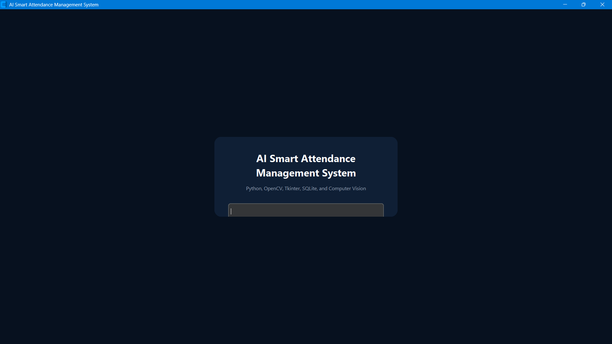
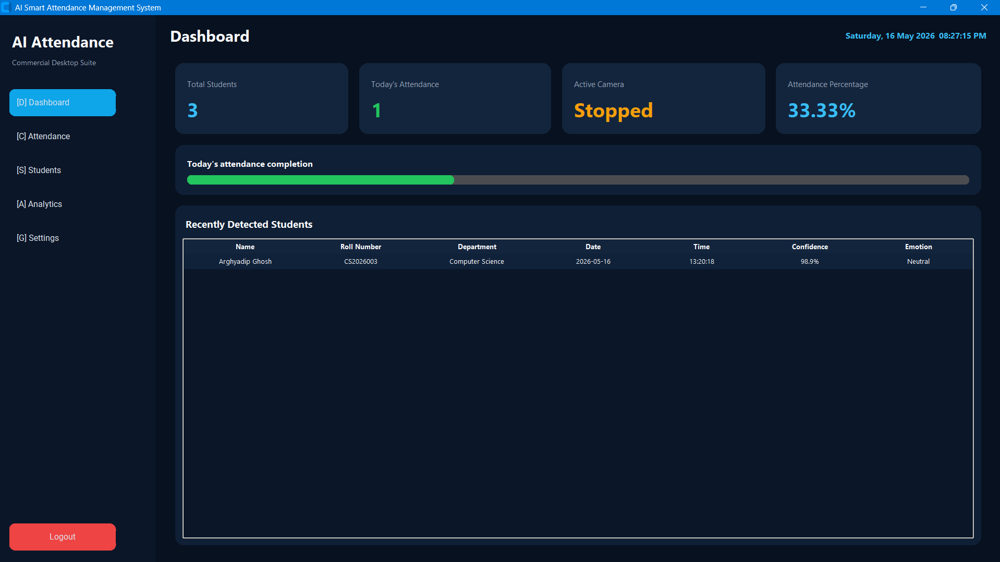
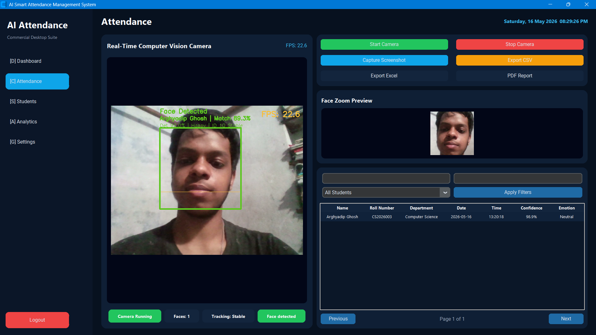
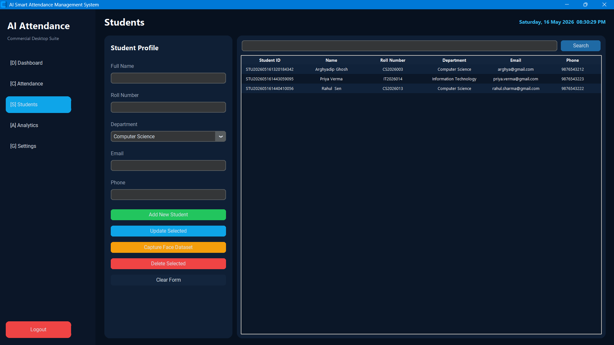
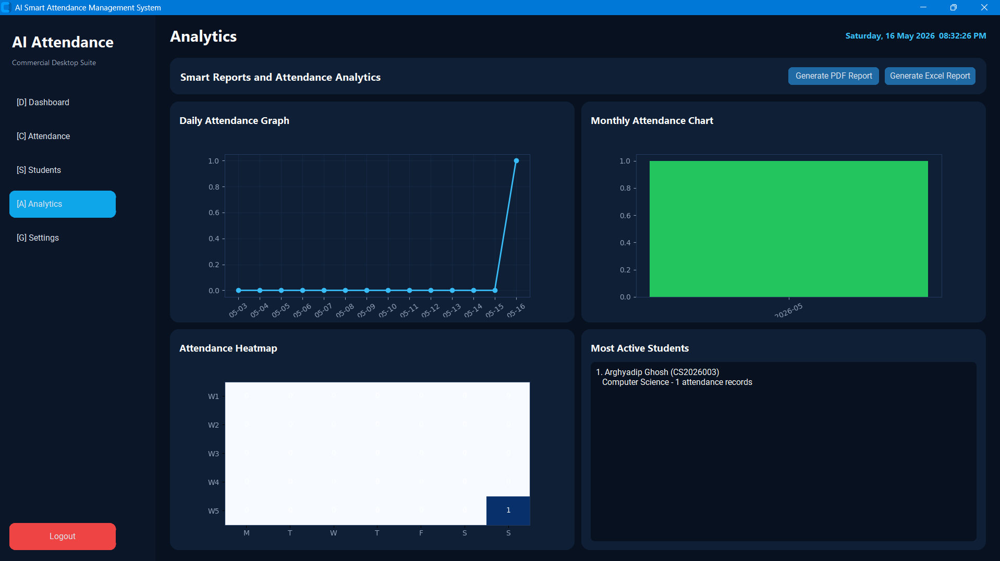
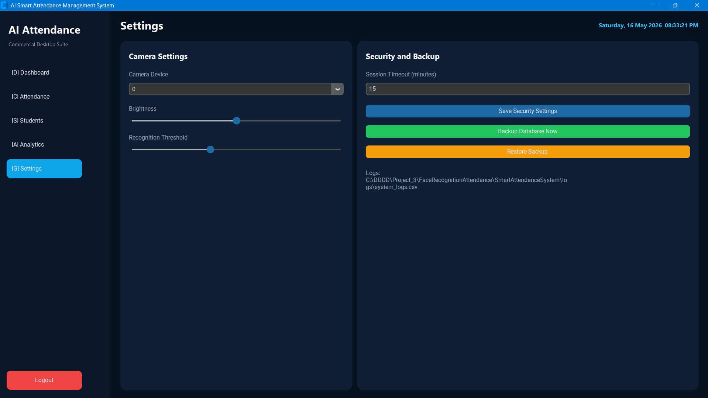

# AI Smart Attendance Management System using Python, OpenCV, Tkinter, SQLite, and Computer Vision

A professional desktop application for smart attendance tracking with real-time computer vision, student management, SQLite storage, analytics, reports, backups, and a modern dark UI.

The project is designed for Windows, Python 3.11, college major projects, placements, and software interviews. It does not use `face_recognition` or `dlib`, so it does not require Visual Studio Build Tools.

## Default Login

```text
Username: admin
Password: admin123
```

Change the default password logic before using this in a real deployment.

## Main Features

- Admin login with password-protected dashboard
- Session timeout and logout
- Modern CustomTkinter dark mode interface
- Sidebar navigation
- Dashboard, Attendance, Students, Analytics, and Settings pages
- Real-time webcam feed inside the GUI
- OpenCV Haar Cascade face detection
- Multiple face detection at the same time
- Animated face rectangle, scan line, and tracking ID
- Detection confidence and recognition confidence display
- Real-time FPS counter
- Face movement tracking
- Face-left-frame status message
- Basic emotion estimate: Happy, Sad, Neutral
- Automatic attendance marking
- Duplicate attendance prevention for the same student on the same day
- SQLite database storage
- CSV attendance log auto-created if missing
- Student registration with unique student ID
- Automatic webcam-based face dataset capture
- OpenCV-only face encoding storage in SQLite
- Unknown face detection when no stored encoding matches confidently
- Edit and delete student profiles
- Attendance table search, date filter, student filter, sorting, and pagination
- Export attendance to CSV
- Export filtered attendance to Excel
- Generate Excel reports
- Generate PDF reports using Matplotlib
- Auto-generate daily CSV reports in `attendance/reports/`
- Dashboard cards for total students, today's attendance, camera status, and percentage
- Daily graph, monthly chart, heatmap, and most active students
- Camera selection and brightness control
- Screenshot capture
- Face zoom preview
- Auto database backup and manual restore
- System logs
- Error popups and sound notifications

## Folder Structure

```text
SmartAttendanceSystem/
|
+-- assets/
|   +-- icons/
|   +-- sounds/
|   +-- themes/
|
+-- database/
|   +-- attendance.db
|   +-- backups/
|
+-- attendance/
|   +-- attendance.csv
|   +-- reports/
|
+-- students/
|   +-- images/
|
+-- screenshots/
+-- logs/
+-- main.py
+-- config.py
+-- requirements.txt
+-- README.md
```

## SQLite Tables

The application uses `database/attendance.db` with these tables:

```text
admin_users
- id
- username
- password_hash
- created_at

students
- id
- student_uid
- name
- roll_number
- department
- email
- phone
- image_path
- status
- created_at
- updated_at

attendance
- id
- student_id
- name
- roll_number
- department
- date
- time
- confidence
- emotion
- camera_id
- created_at

face_encodings
- id
- student_id
- image_path
- encoding
- encoding_dim
- created_at
```

## CSV Format

```csv
Name,Roll Number,Department,Date,Time,Confidence,Emotion
Arghya,CS2026001,Computer Science,2026-05-16,10:45:30,91.5,Neutral
```

## Installation

Open a terminal inside `SmartAttendanceSystem`:

```bash
cd SmartAttendanceSystem
```

Create a virtual environment:

```bash
python -m venv venv
```

Activate it on Windows:

```bash
venv\Scripts\activate
```

Install dependencies:

```bash
pip install -r requirements.txt
```

## Run

```bash
python main.py
```

## How to Use

1. Login with the default admin account.
2. Open the **Attendance** page.
3. Choose the camera from **Settings** if needed.
4. Click **Start Camera**.
5. Go to **Students** and add a student profile.
6. Keep the student's face visible and click **Capture Face Dataset**.
7. Return to **Attendance**. The app detects faces and marks attendance automatically when a registered student is recognized.
8. Use filters, sorting, pagination, and export buttons to manage attendance records.
9. Use **Analytics** to generate PDF and Excel reports.
10. Use **Settings** to backup or restore the database.

## Computer Vision Notes

This project intentionally avoids `face_recognition` and `dlib`. It uses:

- OpenCV Haar Cascade for face detection
- OpenCV-generated face encodings built from normalized face pixels, intensity histograms, LBP texture histograms, and gradient histograms
- SQLite storage for reusable face encodings
- Cosine and distance scoring for lightweight student recognition
- Centroid tracking for movement and leave-frame detection
- Haar Smile Cascade and image brightness/contrast for a basic emotion estimate

This is suitable for a beginner-to-intermediate college project and works without heavy native build tools.

## Sample GUI Screenshot Description

The application opens with a secure dark login screen. After login, a sidebar appears with navigation for Dashboard, Attendance, Students, Analytics, and Settings.

The Dashboard shows commercial-style cards for total students, today's attendance, camera status, and attendance percentage. The Attendance page contains a large webcam panel, FPS counter, animated face boxes, tracking status, zoom preview, camera controls, and a searchable attendance table. The Students page provides a form for profile management and a professional student table. The Analytics page displays charts, a heatmap, top students, and report buttons.

## Resume and Interview Highlights

This project demonstrates:

- Python desktop app development
- OpenCV real-time computer vision
- Tkinter and CustomTkinter GUI engineering
- SQLite database design
- CRUD operations
- CSV, Excel, and PDF reporting
- Multithreaded webcam processing
- Basic authentication and session handling
- Backup and restore workflow
- Modular software architecture
- Error handling and logging

## Screenshots

### Login Page


### Dashboard


### Attendance Recognition


### Student Management


### Analytics


### Settings


## Troubleshooting

- If the camera does not open, check whether another app is using it.
- If recognition is weak, capture a better face image with good lighting.
- If `attendance.csv` is missing, the app recreates it.
- If `attendance.db` is missing, the app recreates the database and default admin user.
- If charts or reports fail, reinstall `matplotlib` and `openpyxl`.
- If `customtkinter` is missing, run `pip install -r requirements.txt`.

## Important Limitations

The face matching method is intentionally lightweight because the project avoids `dlib` and `face_recognition`. For real production biometric attendance, use a certified face recognition model, consent workflows, encryption, audit controls, and privacy compliance.
